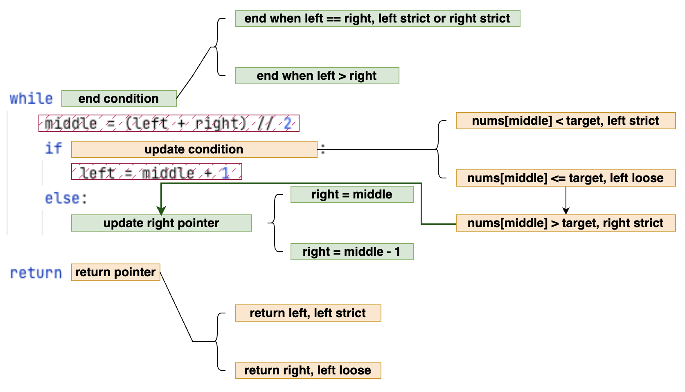
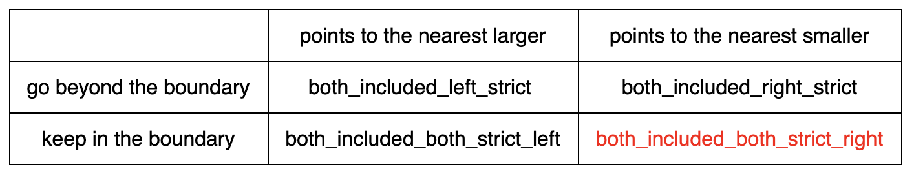

# Overview
There are two types of binary search algorithms:

1. Inclusive at both ends of the range, denoted as '[]'.
2. Inclusive at the left end and exclusive at the right end, denoted as '[)'.

# Essential Considerations for Binary Search
## Both Included
### Overview
When designing a binary search, it's essential to consider four key aspects:

1. end condition
2. update right pointer
3. update condition
4. return pointer

Additionally, it's crucial to be mindful of a specific edge case: When the left and right pointers point to adjacent elements.

Two fundamental statements can greatly simplify the entire code snippet:
1. `middle = (left + right) // 2`: This statement ensures that, in comparison to the right pointer, the middle pointer will be closer to the left pointer.
2. `left = middle + 1`: This statement prevents the code from falling into an infinite loop. Using `left == middle` in the edge case would lead to unintended consequences.

With these considerations, including four aspects, one edge case, and two fixed statements, you can confidently design an effective binary search algorithm. Refer to the accompanying diagram

for a visual representation.

- "end condition" - "update right pointer" pair:
Notably, the interplay between the "end condition" and "update right pointer" is crucial. When using `left == right` as the end condition, opt for a "left strict" mode to ensure the left pointer doesn't miss the possible target value.

- "update condition" - "return pointer" pair:
The "update condition" and "return pointer" exhibit a paired relationship. In "left strict" mode, the left pointer is returned, aiming not to overlook the target value and keeping the possible target value to its right. Conversely, in "left loose" mode (akin to "right strict"), the right pointer is returned, ensuring not to miss the target value and keeping the possible target value to its left.

### Fuzzy target
It's essential to consider scenarios where the exact target value may not exist. In "left strict" mode, the left pointer tends to point to the larger value, while in "left loose" mode, the right pointer tends to point to a smaller value. Therefore, the "left strict" mode selects the nearest larger value, while the "left loose" mode chooses the nearest lower value. Additionally, the stop condition determines whether the final index surpasses the boundary.

For a more detailed understanding, refer to the following table:

### Some Variations
#### find minimum in rotated sorted array ii
The question involves a rotated sorted array, indicating it comprises at most two monotonically increasing chunks. Refer to the [code](https://github.com/liushuyu6666/Algorithm_Leetcode_Python/tree/master/src/Find_Minimum_in_Rotated_Sorted_Array_II) for details on "end condition" and "update right pointer."

  
