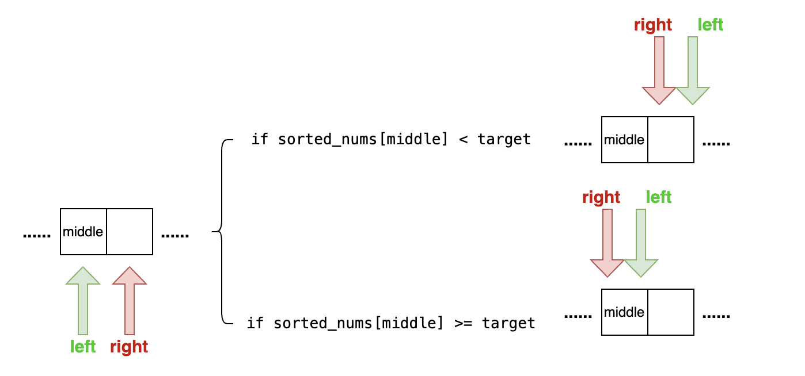

# Overview
There are two types of binary search algorithms:

1. Inclusive at both ends of the range, denoted as '[]'.
2. Inclusive at the left end and exclusive at the right end, denoted as '[)'.

# Essential Considerations for Binary Search
## Both Included
The binary search algorithm is structured as follows:

The structure comprises four essential components:
1. loop condition:
   - If the loop condition is `left < right`, it is lenient and allows for conditions such as `left = middle` or `right = middle`. However, if the condition is `left <= right`, it becomes strict and cannot tolerate `left = middle` or `right = middle`, leading to potential infinite loops.
2. update middle pointer:
   - The middle pointer can be updated in two ways:
     - Move it closer to the left pointer. 
     - Move it closer to the right pointer.
3. move pointers:
   - The standard code snippet for moving pointers is:
    ```python
    if sorted_nums[middle] < target:
        left = middle + 1
    elif sorted_nums[middle] > target:
        right = middle - 1
    ```
   - The treatment of the condition `sorted_nums[middle] == target` determines the return pointer.
4. return pointer

Additionally, binary search may involve variations to address specific scenarios:
1. When the exact target value doesn't exist, decide whether to return the closest larger or closest lower value. 
2. In cases where multiple target values exist, decide whether to return the first or last occurrence.

To address these considerations, it is crucial to leverage an edge case where the left and right pointers point to adjacent elements. This edge case helps determine all four components.

Consider the example of the `both_included_both_strict_left` method. The loop condition `left < right` in this method allows the "move pointers" section to tolerate `right = middle`. Furthermore, by updating the middle pointer closer to the left pointer, and assuming the edge case where pointers move as illustrated below:



This assumed edge case prevents infinite loops and guides the decision to return either the left or right pointer, ensuring a robust binary search implementation.


### Some Variations
#### find minimum in rotated sorted array ii
The question involves a rotated sorted array, indicating it comprises at most two monotonically increasing chunks. Refer to the [code](https://github.com/liushuyu6666/Algorithm_Leetcode_Python/tree/master/src/Find_Minimum_in_Rotated_Sorted_Array_II) for details on "end condition" and "update right pointer."

  
