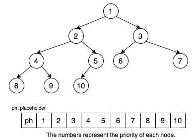

- [Overview](#overview)
- [Binary Heap](#binary-heap)
  - [Max Heap Implementation](#max-heap-implementation)
    - [Basic Operations:](#basic-operations)

# Overview
A heap is a tree-based data structure with various applications in algorithmic solutions.

# Binary Heap
A binary heap is structured as a complete binary tree, ensuring that all levels, except possibly the last, are completely filled. The filling follows a left-to-right pattern, facilitating efficient representation using an array.

The binary heap property is contingent on whether it's a max heap or a min heap:

- Min Heap: For every node `i`, the value of `i` is less than or equal to the values of its children. Consequently, the smallest element resides at the root, and each subtree maintains the min heap property.

- Max Heap: For every node `i`, the value of `i` is greater than or equal to the values of its children. As a result, the largest element is positioned at the root, and each subtree adheres to the max heap property.

Binary heaps find widespread application in algorithms such as heap sort, priority queues, and graph algorithms like Dijkstra's algorithm. They offer an efficient means of managing a dynamically changing set of elements where rapid access to the extreme value is crucial.

## Max Heap Implementation
Illustrated below is a max heap structure: 

The implementation of the max heap involves utilizing an array to store all elements. It is imperative to include a placeholder at the beginning of the array to streamline the algorithm. For a given node `i`, its left child is located at index `i * 2`, its right child is at index `i * 2 + 1` and its parent node is at index `i // 2`

### Basic Operations:
1. Swim: Swap the current node with its parent node if the parent node is smaller, then move upwards.
2. Sink: Swap the current node with one of its larger child nodes if the larger child node is greater than the current node, then move downwards.
3. Initialize: Perform a 'swim' operation on all nodes from the bottom, excluding leaf nodes.
4. Push: Add a new node at the bottom and perform a 'swim' operation.
5. Pop: Remove the top node, place the last node at the top, then perform a 'sink' operation on this new top node.

Refer to the provided code for comprehensive details on the implementation of these operations.

## Min Heap Implementation
A min-heap is implemented similarly to a max-heap, with the key difference being that in a min-heap, each parent node is smaller than its children.

# Keep in Mind
1. A placeholder element will be added at the head of the heap, so that:
   1. `left_child_index` = `curr_index` * 2
   2. `right_child_index` = `curr_index` * 2 + 1
   3. `parent_index` = `curr_index` // 2

